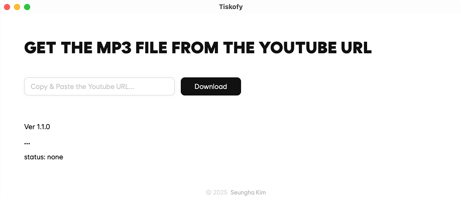

# Tiskofy

- This desktop application lets you paste a YouTube video URL and extracts just the audio, saving it as an MP3 file.
- Built with Rust and TypeScript using the [Tauri](https://tauri.app/) framework.
- Screenshot
  
